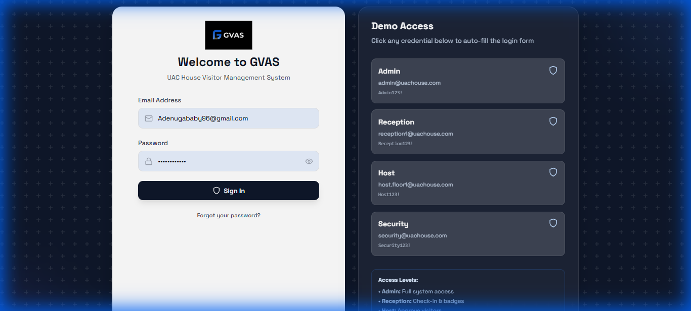
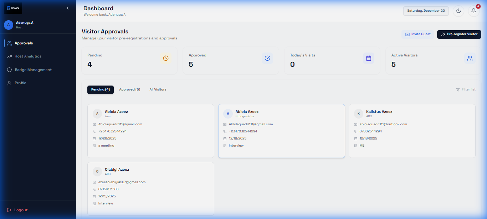
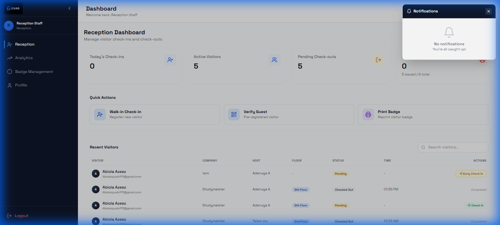
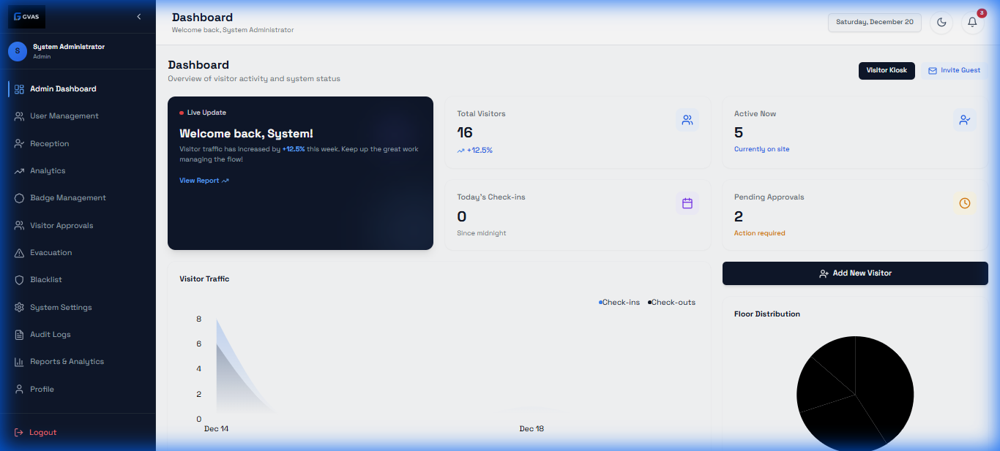

# GVAS - User Manual & Guide

Welcome to the Guest and Visitor Attendance System (GVAS). This document provides a comprehensive guide to navigating and using the system for all employee roles. GVAS is designed to secure the premises while ensuring a smooth, professional experience for all guests.

---

## Table of Contents
1. Getting Started
2. Notifications System
3. Visitor Flows (Walk-in vs. Pre-registered)
4. Guest Self-Registration
5. For Hosts (Employees)
6. For Receptionists
7. For Administrators
8. For Security Personnel
9. Troubleshooting

---

## Getting Started

### Accessing the System
- Login: Enter your official email and password.
- Role-Based Access: Upon login, you will be automatically directed to the correct dashboard (Host, Reception, Admin, or Security).

---

## Notifications System
The GVAS notification system ensures real-time communication between guests, receptionists, and hosts.

- Reception Notifications: Receptionists receive alerts when a guest pre-registers or when a host approves a walk-in.
- Host Notifications: Hosts receive instant alerts (via the dashboard and email) when a visitor arrives at the lobby and requests entry.
- Visual Indicator: A red dot on the bell icon (top right) indicates unread alerts. Clicking it reveals the message and visit details.

---

## Visitor Flows

### 1. The Add Guest Flow (Walk-in)
For visitors who arrive without a prior invitation:
1. Reception clicks Walk-in Check-in.
2. Form Entry: Enter the visitor's name, email, phone, company, and purpose of visit.
3. Host Selection: Choose the host the visitor is seeing.
4. Submission: Upon submission, the host receives an approval request.
5. Approval: Once the host clicks "Approve" on their dashboard, the visitor can be fully checked in.

### 2. The Invitation Flow
For scheduled meetings:
1. Host pre-registers the guest (see Host Guide).
2. The system sends an automated invitation email.
3. Invite Contents: The email includes a 6-digit Guest Code and a unique QR Code.

---

## Guest Self-Registration
Guests can save time by pre-registering themselves via their own devices or a lobby kiosk.

### How it works:
1. The guest visits the public registration URL.
2. Information Entry: The guest provides their own details and selects their host.
3. Visit Scheduling: They choose their intended visit date and time.
4. Confirmation: After submitting, the guest receives their digital pass (QR Code) via email instantly.

---

## For Hosts (Employees)
As a host, you manage invitations and guest approvals.

### Pre-registering a Guest
1. Click Invite Guest or Pre-register Visitor on your dashboard.
2. Enter the guest's details (Name, Email, Phone).
3. Select the Visit Date and Time.
4. Click Submit.

### Approving Visitors
- When your guest arrives, check your Notifications or the Pending Approvals list.
- Review the visitor's information and click Approve.

---

## For Receptionists
You manage the front desk flow and visitor identification.

### Checking In Visitors
- QR Scan: Read the guest's QR code for instant check-in.
- Manual Verification: For walk-ins, confirm the host has approved before clicking Confirm Check-in.
- Badge Printing: Click Print Badge to generate the physical pass.

### Checking Out
- Locate the visitor in the Active Visitors list and click Check Out.

---

## For Administrators
Full visibility and configuration control.

### Management Tools
- User Management: Add or deactivate staff accounts.
- Audit Logs: Review a history of all system activities.
- Reporting: Export CSV/PDF reports of visitor traffic.

---

## For Security Personnel
Focus on building safety and live occupancy tracking.

### Safety Features
- Evacuation List: Real-time list of every person in the building, sorted by floor.
- Blacklist: Flag individuals to restrict entry.

---

## Troubleshooting
- Cannot Scan QR: Ensure the visitor's screen brightness is high.
- Sync Issues: Use the Live Update button if data doesn't appear immediately.

---
UAC House GVAS - Version 2.0
